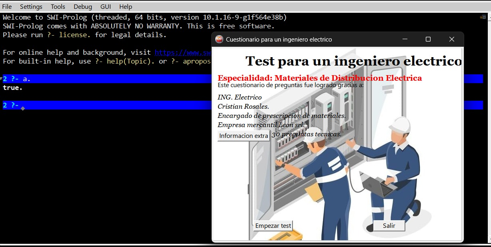
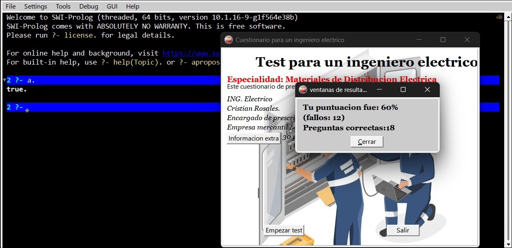

# Proyecto para un Test de preguntas para un ING. electrico
Para poder desarrollar este proyecto se entrevisto por medio de mensajes y llamadas a un ingeniero electrico, encargado de prescripcion de materiales.

## Integrantes
   -Juan Ernesto Cordero Pozo
   
   -Francisco  Mendez

## Informacion directa
- [Informacion](#Informacion)
- [Descripcion](#descripcion)
- [Uso](#uso)

## Informacion 
   - **ING. Electrico**
   - **Cristian Rosales**
   - **Encargado de prescripción de materiales.**
   - **Empresa mercantil León srl.**
   - **Ubicación av. Melchor pinto, primer anillo.**

## Descripcion 

Un ingeniero electrico encargado de la prescripcion de materiales o tambien conocido como ingeniero de compras o de especificaciones tecnicas, es responsable de determinar y seleccionar los materiales y componentes electricos adecuados para un proyecto especifico, esto incluye desde cables y equipos de proteccion hasta transformadores y equipos de medicion.

## Uso
Ejecutar el codigo "Test tecnico para ingeniero  electrico" con el comando.

>>>>>>COMANDO: " a. " 

 ya no es necesario el comando "a." a menos de que le hayas dado  "salir".
 
 
### ejecutando proyecto, interfaz 1 (dashboard)

### ejecutando proyecto, interfaz 2 (resultado de la prueba)

